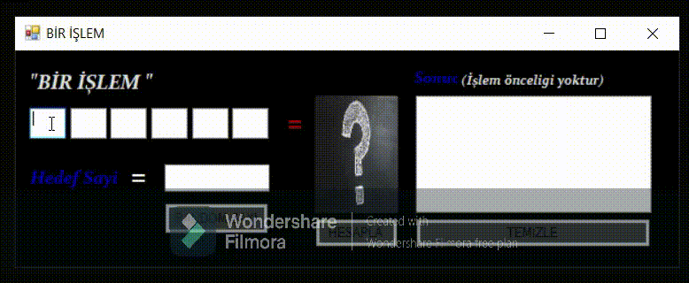
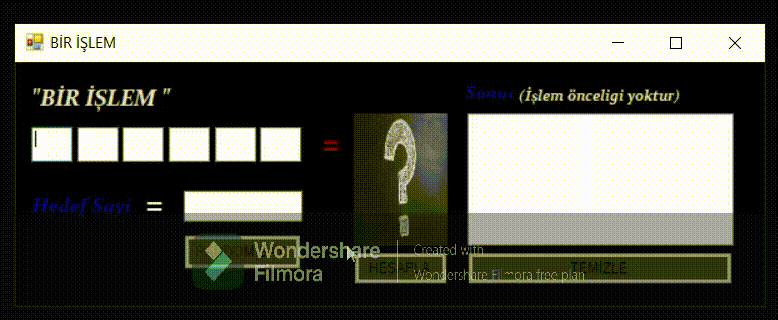

# CSharp-Form-Bir-Kelime-Bir-Islem-Islem-Kismi

Bir Kelime Bir İşlem TV Programı düşünülerek oluşturulan uygulamanın işlem kısmıdır. Uygulama kullanıcının girdiği beş rakam ve bir çift haneli sayı ile veya random olarak aldığı 6 sayı ile hedef üç haneli sayının nasıl hesaplanacağını bulup yazdırmaktadır.
 

